# Welcome to Docker - Projet 3 (Part 2)

Exercice pratique sur le cycle de vie complet d'une image Docker : cloner un projet, analyser le Dockerfile, construire l'image, lancer un conteneur, modifier le code source, reconstruire, et publier sur Docker Hub.

## Technologies utilisées
- Docker 28.2.2
- Node.js 22 (Alpine)
- React (create-app-react)
- Ubuntu 14.04 LTS (WSL2)

---

## Étape 1 — Cloner explorer le projet

Le projet officiel `docker/welcome-to-docker` a été cloné depuis Github. Il contient le code source d'une aplpication React et un Dockerfile qui décrit comment construire l'image.
```
git clone https://github.com/docker/welcome-to-docker.git
ls
```

Le dossier contient : le `Dockerfile` (la recette de fabrication), `package.son` (les dépendances Node.js), le dossier `src/` (le code React) et `public/` (les fichiers statiques).

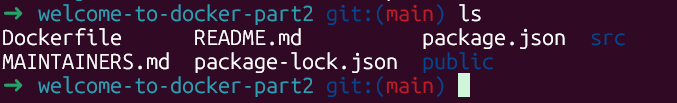

---

## Étape 2 — Analyser le Dockerfile

Le Dockerfile est la recette de fabrication de l'image. Chaque instructino à un rôle précis :
```
cat Dockerfile
```

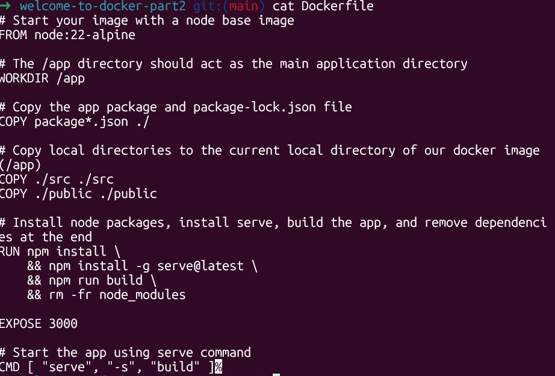

### Explication de chaque instruction

| Instruction | Rôle |
|-------------|------|
| `FROM node:22-alpine` | Image de base — Linux minimal avec Node.js 22 préinstallé |
| `WORKDIR /app` | Définit le répertoire de travail à l'intérieur du conteneur |
| `COPY package*.json ./` | Copie les fichiers de dépendances en premier (optimisation du cache) |
| `COPY ./src ./src` | Copie le code source React |
| `COPY ./public ./public` | Copie les fichiers statiques |
| `RUN npm install && ...` | Installe les dépendances, compile l'app, supprime node_modules |
| `EXPOSE 3000` | Déclare que le conteneur écoute sur le port 3000 |
| `CMD ["serve", "-s", "build"]` | Commande exécutée au démarrage du conteneur |

---

## Étape 3 — Construire l'image (docker build)

L'image a été construire localement à partir du Dockerfile. Docker exécute chaque instruction couche par couche.
```
docker build -t welcome-app .
```

### Début du build — téléchargement de l'image de base

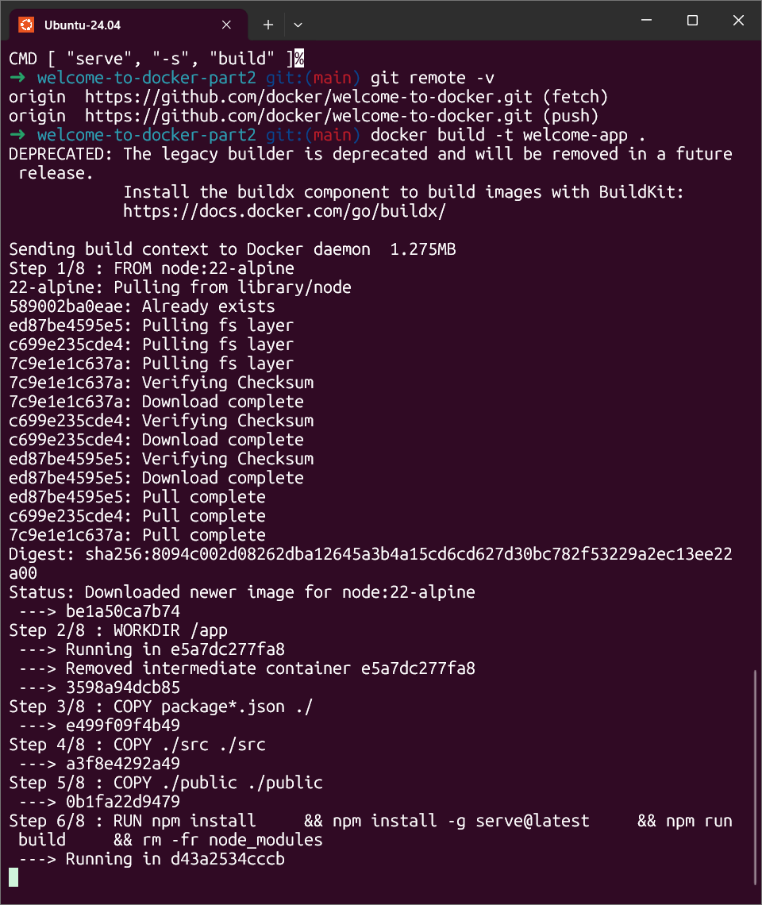

### Installation des dépendances npm

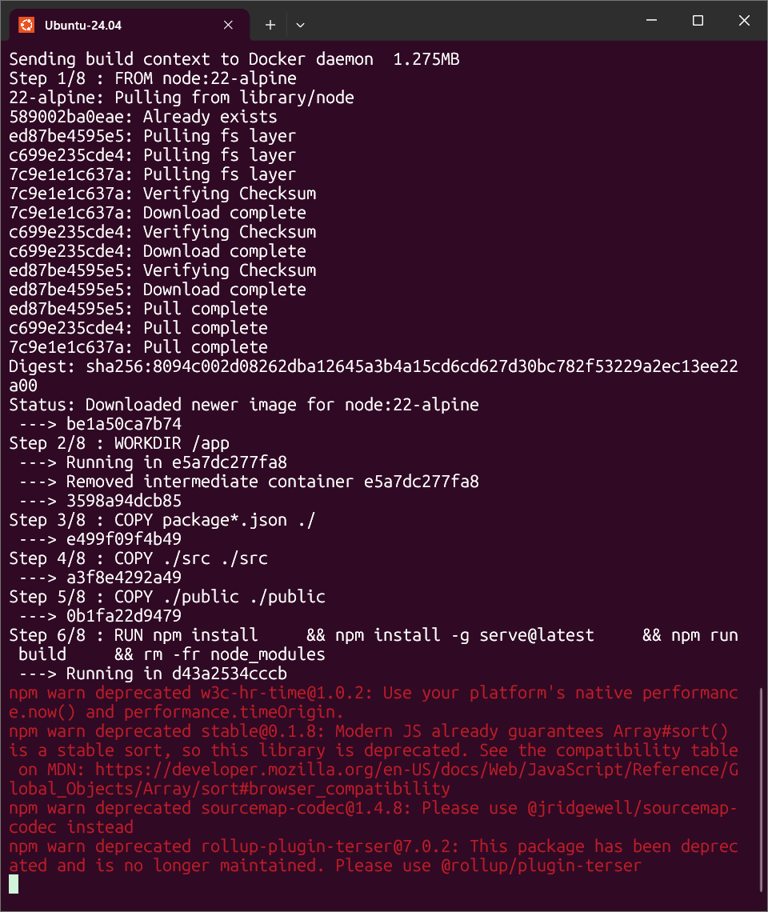

### Paquets installés et avertissements

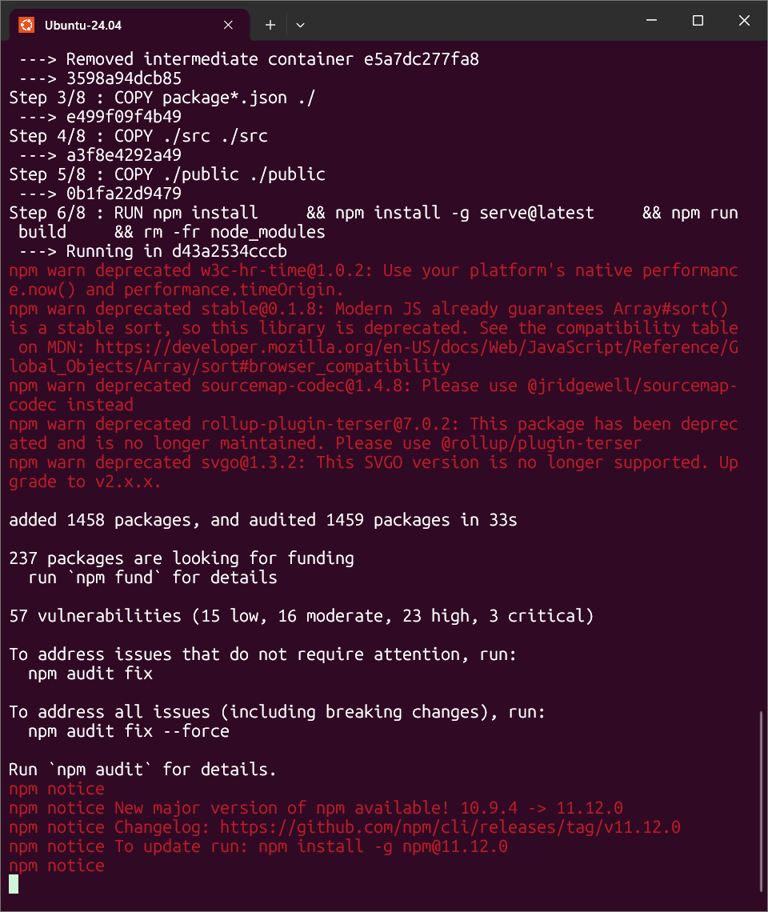

### Comilation React réussie

Le message "Compiled successfully" confirme que l'application a été compilée en fichiers HTML/CSS/JS optimisés pour la production.

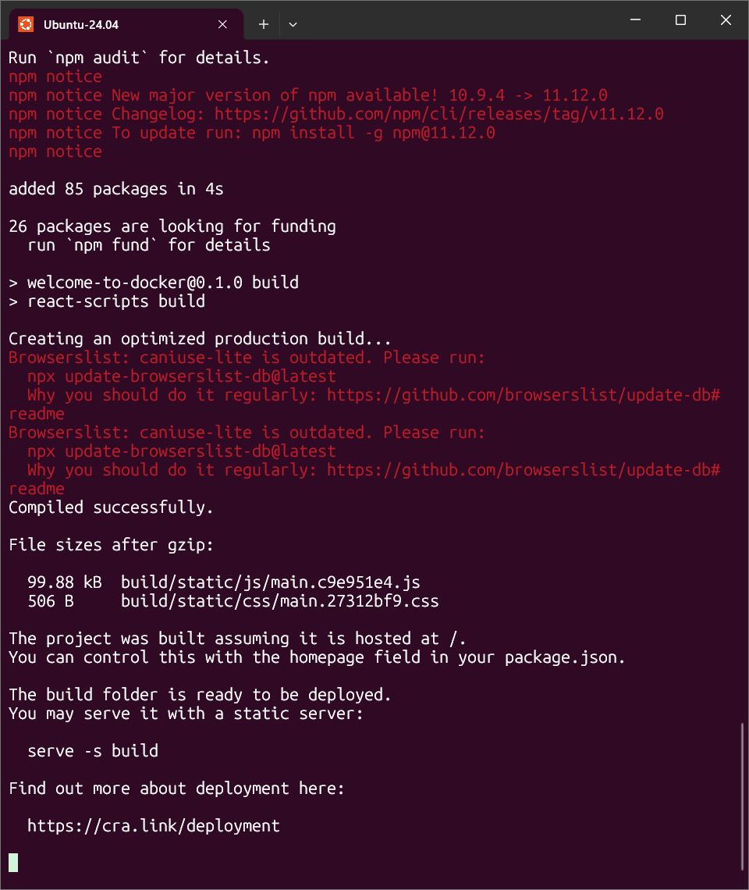

### Build terminé et vérification de l'image

L'image `welcome-app` apparaît dans la liste avec une taille de 283 Mo.

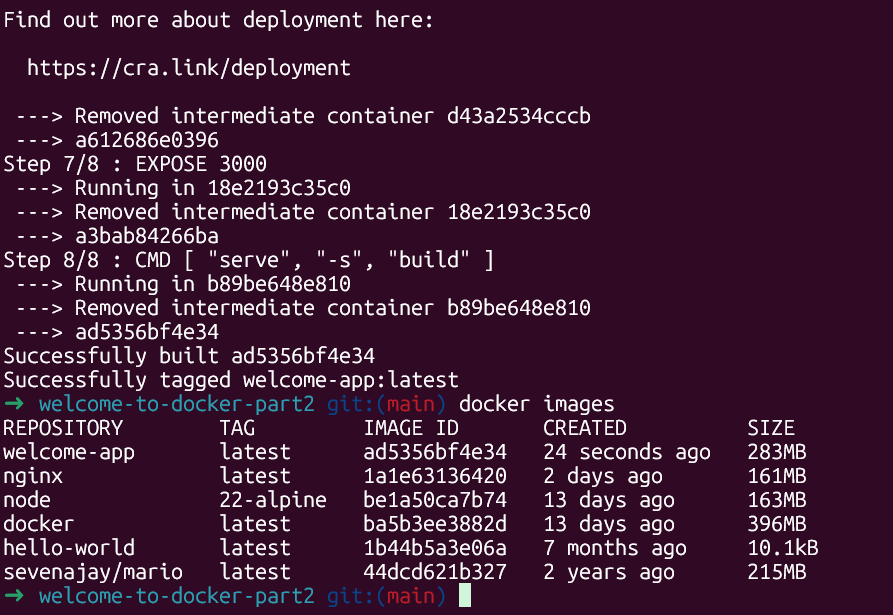
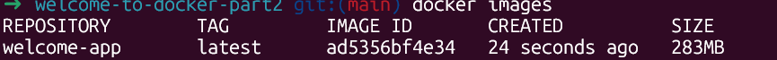

---

## Étape 4 — Lancer le conteneur et accéder à l'application
```
docker run -d -p 8088:3000 --name welcome-app welcome-app
```

Le mapping `-p 8088:3000` redirige le port 8088 de la machine locale vers le port 3000 du conteneur. L'application est accessible via `http://localhost:8088`.


---

## Étape 5 — Modifier le code source

Le texte "Congratulations!!!" a été localisé dans le fichier `src/App.js` grâce à la commande `grep` :
```
grep -r "Congratulations" src/
```


Le texte a été modifié dans `src/App.js`, puis l'image a été reconstruite et le conteneur relancé. La modification n'apparaît qu'après reconstruction — c'est le cycle : **modifier -> reconstruire -> relancer**.

```
docker stop welcome-app && docker rm welcome-app
docker build -t welcome-app .
docker run -d -t 8088:3000 --name welcome-app welcome-app
```


---

## Étape 6 — Connexion à Docker Hub

Docker Hub exige un Personal Access Toek (PAT) au lieu du MDP classique pour la connexion en ligne de commande. Les premières tentatives avec le mot de passe ont échoué.
```
docker login -u drajoan258
```

### Erreurs rencontrées

Le message "your account must log in with a Pesonal Acces Token" indique que les mot de passe classique n'est plus accepté. Un PAT a été généré depuis https://app.docker.com/settings.

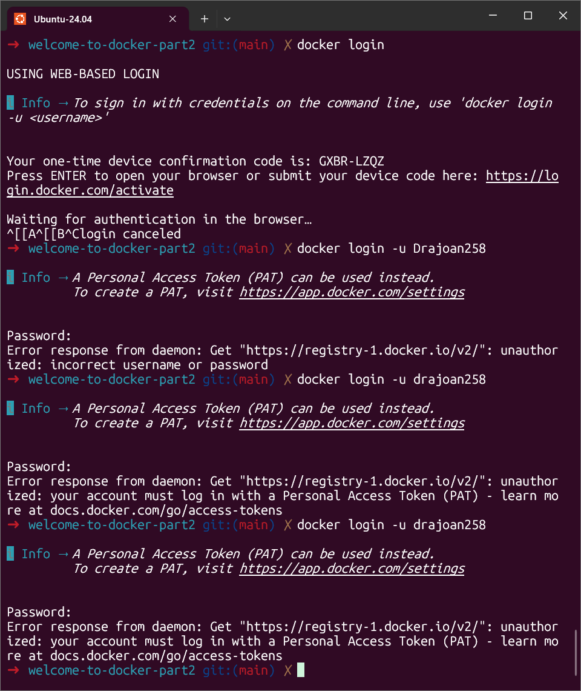
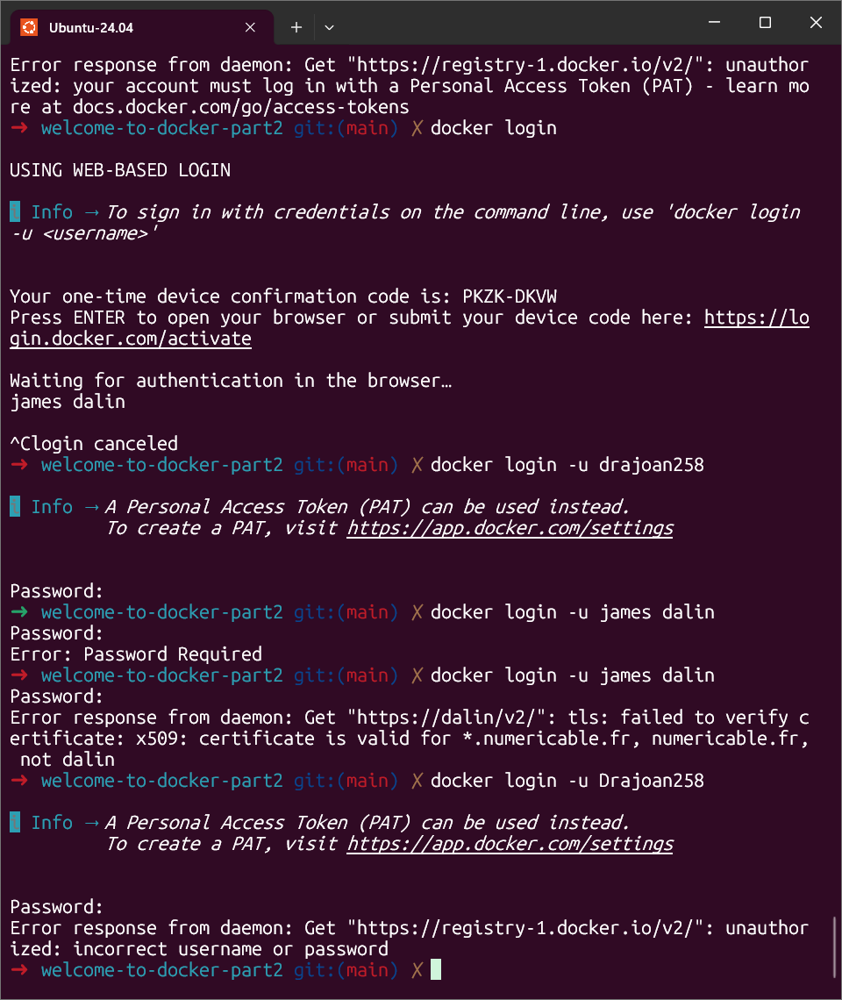

### Connexion réussie avec le PAT

Après création du Personal Access Token et utilisation comme mot de passe, la connexion à réussi. L'image a ensuite été taguée et vérifiée.
```
docker tag welcome-app drajoan258/welcome-app:v1
docker images
```

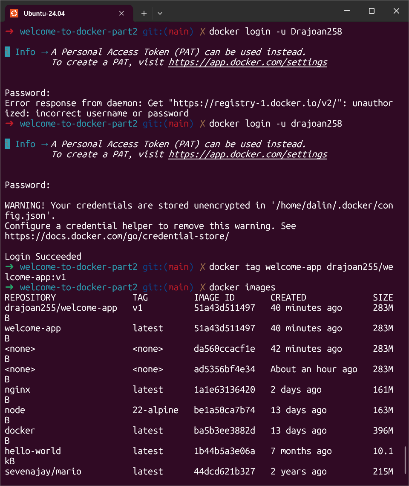

---

## Étape 7 — Publication sur Docker Hub

L'image a été poiussée vers Docker hub et est désomais accessible publiquement.
```
docker push drajoan258/welcome-app:v1
```

N'importe qui peut la récupérer avec :
```
docker pull drajoan258/welcome:v1
```

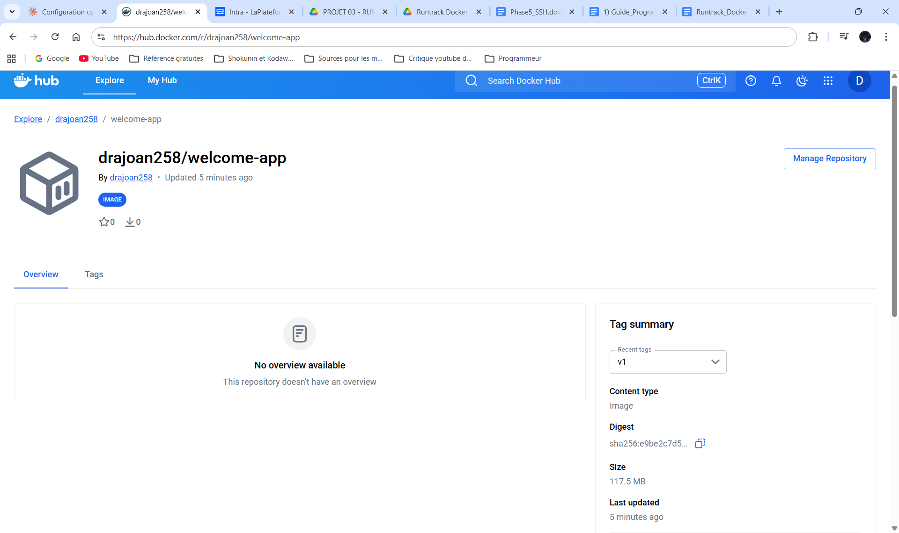

---

## Leçons apprises

Ce projet à mis en évidence le cycle de vie complet d'une image Docker :

1. **Cloner** le code source depuis Github
2. **Analyser** le Dockerfile pour comprendre la recette de fabrication
3. **Construire** l'image avec `docker build`
4. **Lancer** un conteneur avec `docker run`
5. **Modifier** le code source dans l'éditeur
6. **Reconstruire** l'image pour intégrer les modifications
7. **Publier** l'image sur Docker Hub pour la rendre accessible au monde

La modification du code source ne se reflète pas automatiquement dans le conteneur en cours. Il faut systématiquement arrêter le conteneur, reconstruire l'image, et relancer — c'est le cycle fondamental du développement avec Docker.

